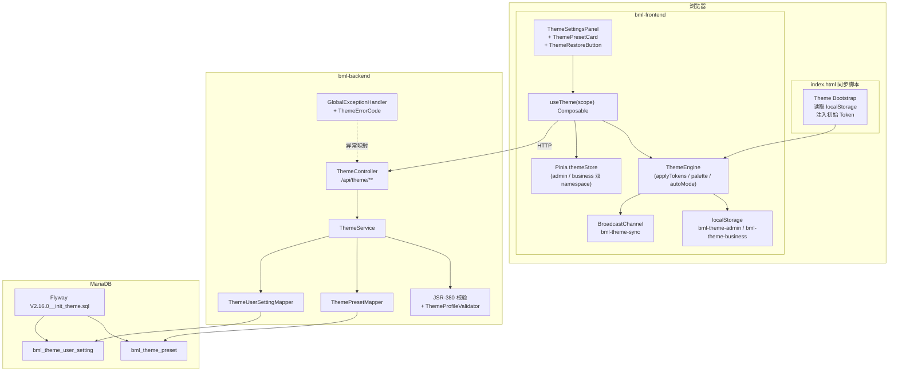
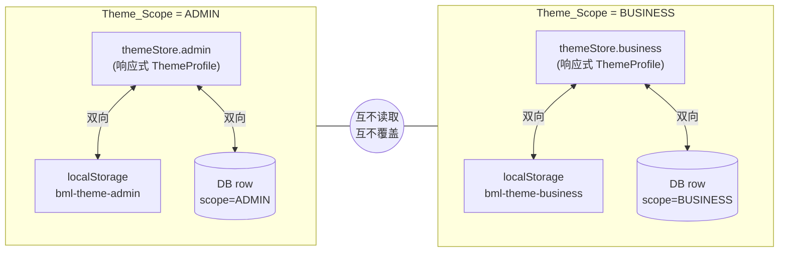
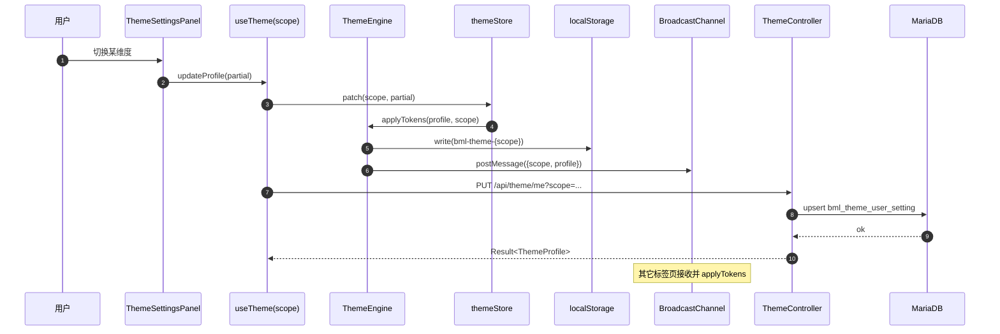

# Design Document

## Overview

本设计针对 BML 平台 **中台管理（Admin）** 与 **业务系统（Business）** 两套主题设置的整体重构，目标是把当前散落于 `ThemeSettings.vue`、`utils/theme.ts`、`store/app.ts` 中的局部主题逻辑，升级为一个**通用、可扩展、可跨设备同步、防 FOUC** 的多维主题引擎。

设计核心原则：

1. **单一引擎，双重作用域**：底层只有一套 `ThemeEngine` / `useTheme` / 后端表结构，通过 `Theme_Scope = ADMIN | BUSINESS` 隔离运行时状态与持久化数据。
2. **Token 化驱动**：所有可视组件的颜色、圆角、字号、间距、阴影一律由 CSS 自定义属性（`--bml-*`、`--arcoblue-*`）派生；禁止业务组件硬编码主题相关样式。
3. **PRESET_BEST 至高优先**：内置 `PRESET_BEST`（毛玻璃 + 柔和渐变 + 高对比可读性）同时具备亮/暗变体，作为首次访问、未登录、配置缺失、"恢复默认"动作的统一目标。
4. **防 FOUC + 跨标签同步**：在 `<head>` 内联同步脚本读取 `localStorage` 完成首屏 Token 注入；多标签使用 `BroadcastChannel` 同步。
5. **统一响应 + 统一异常**：所有后端接口包装为 `Result<T>`，错误通过 `GlobalExceptionHandler` 映射为统一错误码（新增 `ThemeErrorCode` 枚举实现 `ErrorCode`）。
6. **版本统一管控**：新增依赖一律在父 `pom.xml` 与前端 `package.json` 顶层声明；不引入 alpha/beta/rc 版本。

本设计在不破坏现有 `app.ts` Pinia store 与 `ThemeSettings.vue` 用户习惯的前提下，将其重构为通用引擎与组件家族；并在 `bml-module-system` 模块新增 `theme` 子包承载 Controller / Service / Mapper / Entity。

## Architecture

### 总体架构



### 作用域隔离模型



`useTheme(scope)` 始终接收明确作用域参数；当上层调用方未传入时，按需求 R8.AC8 通过当前路由所在布局推断（Admin 嵌套 Business 时取外层 Admin），无法识别则抛出 `THEME_SCOPE_UNRESOLVED`。

### 主题数据流



### 防 FOUC 引导流程

```mermaid
sequenceDiagram
    autonumber
    participant Browser
    participant HTML as index.html<br/>&lt;head&gt; 内联脚本
    participant LS as localStorage
    participant App as Vue App
    participant Hook as useTheme

    Browser->>HTML: 加载 HTML
    HTML->>LS: 读 bml-theme-admin / bml-theme-business
    alt 命中本地缓存
        HTML->>HTML: 设置 :root style + body[arco-theme]
    else 未命中
        HTML->>HTML: 应用 PRESET_BEST 内联默认 Token
    end
    Browser->>App: 加载 main.ts
    App->>Hook: bootstrap(scope)
    Hook->>Hook: 后续按需校准 + 拉取服务端
```

## Components and Interfaces

### 后端组件

#### 模块归属

放置于 `bml-modules/bml-module-system/src/main/java/com/bml/module/system/theme/` 子包，包含：

```
theme/
├─ controller/  ThemeController.java
├─ service/     ThemeService.java
│              impl/ThemeServiceImpl.java
├─ mapper/      ThemePresetMapper.java
│              ThemeUserSettingMapper.java
├─ entity/      ThemePreset.java
│              ThemeUserSetting.java
├─ dto/         ThemeProfileDTO.java
│              ThemePresetUpsertDTO.java
├─ vo/          ThemeProfileVO.java
│              ThemePresetVO.java
├─ enums/       ThemeScope.java
│              ThemeMode.java
│              SidebarStyle.java
│              HeaderStyle.java
│              RadiusStyle.java
│              Density.java
│              FontScale.java
│              ThemeErrorCode.java  // implements ErrorCode
├─ converter/   ThemeProfileConverter.java  (MapStruct)
├─ validator/   ThemeProfileValidator.java
│              HexColor.java         (自定义注解)
└─ constant/    ThemeConstants.java   // 含 PRESET_BEST_ID 等
```

#### 接口契约（全部包装于 `Result<T>`）

| 方法 | 路径 | 权限 | 说明 |
|---|---|---|---|
| GET  | `/api/theme/presets` | 已登录 | 返回所有预设（含内置与自定义），按 `sortOrder` 排序 |
| GET  | `/api/theme/me?scope={ADMIN\|BUSINESS}` | 已登录 | 当前用户该作用域 Profile；无记录则返回 PRESET_BEST 对应变体 |
| PUT  | `/api/theme/me?scope={ADMIN\|BUSINESS}` | 已登录 | upsert 当前用户 Profile |
| POST | `/api/theme/restore?scope={ADMIN\|BUSINESS}` | 已登录 | 重置为 PRESET_BEST 并返回新 Profile |
| GET  | `/api/theme/default?scope={ADMIN\|BUSINESS}` | 公开（用于未登录页） | 返回 PRESET_BEST 在指定作用域的变体 |
| POST | `/api/theme/presets` | `system:theme:manage` | 新增自定义预设 |
| PUT  | `/api/theme/presets/{id}` | `system:theme:manage` | 修改自定义预设；内置预设拒绝 `THEME_BUILTIN_NOT_MUTABLE` |
| DELETE | `/api/theme/presets/{id}` | `system:theme:manage` | 删除自定义预设；内置预设拒绝；删除后引用置空 |

控制器示例签名（节选）：

```java
@RestController
@RequestMapping("/api/theme")
@RequiredArgsConstructor
@Tag(name = "主题设置", description = "中台/业务系统主题配置接口")
public class ThemeController {
    private final ThemeService themeService;

    @GetMapping("/me")
    public Result<ThemeProfileVO> getMyProfile(
            @RequestParam @NotNull ThemeScope scope) {
        return Result.success(themeService.getMyProfile(scope));
    }

    @PutMapping("/me")
    public Result<ThemeProfileVO> updateMyProfile(
            @RequestParam @NotNull ThemeScope scope,
            @Validated @RequestBody ThemeProfileDTO dto) {
        return Result.success(themeService.upsertMyProfile(scope, dto));
    }

    @PostMapping("/restore")
    public Result<ThemeProfileVO> restore(
            @RequestParam @NotNull ThemeScope scope) {
        return Result.success(themeService.restoreToBest(scope));
    }

    @PreAuthorize("@ss.hasPermi('system:theme:manage')")
    @PostMapping("/presets")
    public Result<ThemePresetVO> createPreset(
            @Validated @RequestBody ThemePresetUpsertDTO dto) {
        return Result.success(themeService.createPreset(dto));
    }
    // ... 其余略
}
```

#### `ThemeErrorCode`（实现 `com.bml.core.common.result.ErrorCode`）

```java
public enum ThemeErrorCode implements ErrorCode {
    THEME_INVALID_PROFILE(40_010, "主题配置存在非法字段"),
    THEME_SCOPE_INVALID(40_011, "非法作用域参数"),
    THEME_PRESET_NOT_FOUND(40_410, "主题预设不存在"),
    THEME_BUILTIN_NOT_MUTABLE(40_310, "系统内置预设不可修改或删除"),
    THEME_PERSIST_FAILED(50_010, "主题持久化失败");
    private final int code; private final String message;
    // 构造与 getter 略
}
```

非法 `Profile` 校验错误响应中 `data` 字段返回 `List<FieldError>`，结构 `{field, code, message}`，由 `ThemeProfileValidator` 在 service 入口校验后抛出 `BusinessException(THEME_INVALID_PROFILE, fieldErrors)`，由 `GlobalExceptionHandler` 携带 `data` 序列化。

### 前端组件

#### 文件组织

```
src/
├─ styles/
│  ├─ tokens.scss              // 全局 Token 定义（CSS 变量默认值）
│  └─ tokens.preset-best.scss  // PRESET_BEST 亮/暗变体常量（导出供 bootstrap 使用）
├─ types/
│  └─ theme.ts                 // ThemeProfile / ThemePreset / ThemeScope 等类型
├─ api/
│  └─ theme.ts                 // axios 封装
├─ utils/
│  ├─ themeEngine.ts           // applyTokens / generatePalette / autoMode
│  ├─ themeBootstrap.ts        // index.html 同步脚本（构建期内联）
│  └─ themeBroadcast.ts        // BroadcastChannel 包装
├─ store/
│  └─ theme.ts                 // Pinia themeStore（namespace: admin / business）
├─ composables/
│  └─ useTheme.ts              // 主入口
├─ components/theme/
│  ├─ ThemeSettingsPanel.vue
│  ├─ ThemePresetCard.vue
│  ├─ ThemeRestoreButton.vue
│  ├─ ThemeColorSection.vue
│  ├─ ThemeModeSection.vue
│  ├─ ThemeRadiusSection.vue
│  ├─ ThemeDensitySection.vue
│  ├─ ThemeSidebarSection.vue
│  ├─ ThemeHeaderSection.vue
│  └─ ThemeFontSection.vue
```

旧文件迁移：

- `utils/theme.ts` → `utils/themeEngine.ts`（保留 `generatePalette`、`hexToRgb` 算法，扩展为 Token 写入器）
- `components/ThemeSettings.vue` → `components/theme/ThemeSettingsPanel.vue`（拆分为子区块，新增多维度 props 与 `scope` 参数）
- `store/app.ts` 中主题字段 → `store/theme.ts`（保留 `app.ts` 的非主题字段如 `menuCollapse`、`navbar`，并通过 `useThemeStore()` 替代直接读取）

#### `useTheme` Composable

```ts
export interface UseThemeReturn {
  /** 当前作用域只读 Profile */
  profile: Readonly<Ref<ThemeProfile>>;
  /** 预设列表（含 PRESET_BEST） */
  presets: Readonly<Ref<ThemePreset[]>>;
  /** 加载状态 */
  isLoading: Readonly<Ref<boolean>>;
  /** 错误对象（最近一次） */
  error: Readonly<Ref<ThemeError | null>>;
  /** 部分更新单个或多个维度 */
  updateProfile: (partial: Partial<ThemeProfile>) => Promise<void>;
  /** 应用预设 */
  applyPreset: (presetId: string) => Promise<void>;
  /** 一键恢复 PRESET_BEST */
  restoreDefault: () => Promise<void>;
  /** 当前作用域 */
  scope: ThemeScope;
}

export function useTheme(scope?: ThemeScope): UseThemeReturn;
```

实现要点：
- 内部访问 `themeStore[scope]`，所有写操作均经 `themeEngine.applyTokens` 同步 DOM。
- `updateProfile` 流程：本地 patch → 写 `localStorage` → broadcast → 后台 `PUT /api/theme/me` → 服务端结果回填覆盖本地。
- 后台失败：保留本地更改，触发一次性 `Message.warning('主题云端同步失败...')`，并通过 `error` 暴露给调用方（满足 R13.AC1 — 无论本地缓存是否可用都显示提示）。

#### `themeEngine.applyTokens`

```ts
export function applyTokens(profile: ThemeProfile, scope: ThemeScope, root?: HTMLElement): void;
```

职责清单：
1. 计算主色 10 级色阶（复用现有算法）。
2. 写入 `--bml-*` 与 `--arcoblue-*` 全部变量（颜色、`--bml-radius-{sm,md,lg}`、`--bml-spacing-*`、`--bml-font-size-base`、`--bml-line-height-base`、`--bml-shadow-*` 等）。
3. 设置 `<body>` 属性：`arco-theme` (`light|dark`)、`data-bml-density`、`data-bml-radius`、`data-bml-sidebar`、`data-bml-header`、`data-bml-scope`。
4. 切换过渡：写入 `body.classList.add('theme-transitioning')`，300ms 后移除。
5. 在开发模式下，订阅 `requestAnimationFrame` 后扫描 `getComputedStyle` 检查未知 Token 引用，输出 `console.warn`（开发态告警）。

#### 跨标签同步

`themeBroadcast.ts` 包装 `BroadcastChannel('bml-theme-sync')`，消息体：

```ts
type ThemeBroadcastMessage =
  | { kind: 'profile-changed'; scope: ThemeScope; profile: ThemeProfile; senderId: string }
  | { kind: 'preset-applied'; scope: ThemeScope; presetId: string; senderId: string }
  | { kind: 'restored'; scope: ThemeScope; senderId: string };
```

每个标签生成 `senderId`，接收时忽略自身消息；接收后调用 `themeEngine.applyTokens` 同步。

#### 同步引导脚本（防 FOUC）

`utils/themeBootstrap.ts` 编译为独立 IIFE，由 Vite 插件在 `index.html` `<head>` 注入：

```html
<script>
(function () {
  try {
    var scope = location.pathname.startsWith('/business') ? 'business' : 'admin';
    var raw = localStorage.getItem('bml-theme-' + scope);
    var profile = raw ? JSON.parse(raw) : null;
    var p = profile || /* PRESET_BEST 内联默认 */ window.__BML_PRESET_BEST__[scope];
    var root = document.documentElement;
    // 写入关键 Token（颜色、模式、圆角、字号、密度）
    Object.entries(p.tokens).forEach(function (kv) {
      root.style.setProperty(kv[0], kv[1]);
    });
    document.body.setAttribute('arco-theme', p.mode === 'dark' ? 'dark' : 'light');
    document.body.setAttribute('data-bml-scope', scope);
  } catch (e) { /* 静默回退到 PRESET_BEST 内联默认 */ }
})();
</script>
```

`__BML_PRESET_BEST__` 由构建期生成，确保即使首次访问也能立刻拿到默认 Token，避免任何未上色阶段。

#### Pinia `themeStore`

```ts
interface ThemeStoreState {
  admin: ThemeProfile;
  business: ThemeProfile;
  presets: ThemePreset[];
  loading: { admin: boolean; business: boolean; presets: boolean };
  errors: { admin: ThemeError | null; business: ThemeError | null; presets: ThemeError | null };
}
```

actions：`hydrate(scope)`、`patch(scope, partial)`、`applyPreset(scope, id)`、`restore(scope)`、`fetchPresets()`、`onBroadcast(msg)`。所有写操作内部触发 `themeEngine.applyTokens`、写 `localStorage`、`broadcast`。

#### 通用组件

- `ThemeSettingsPanel`：保留现有抽屉视觉，重组为 7 个 section（颜色、模式、圆角、紧凑度、侧边栏、顶部栏、字体）+ 预设网格 + 恢复默认按钮。Prop：`scope: ThemeScope`、`compact?: boolean`。
- `ThemePresetCard`：渲染预设缩略（侧栏 + 顶栏 + 内容区四色块），点击触发 `applyPreset`。
- `ThemeRestoreButton`：内嵌确认弹窗（`a-popconfirm`），调用 `restoreDefault`，捕获错误并提示。

## Data Models

### 数据库表

```sql
-- bml_theme_preset：主题预设（系统内置 + 平台级自定义）
CREATE TABLE bml_theme_preset (
    id              VARCHAR(64)  NOT NULL COMMENT '预设ID（内置使用语义ID，如 PRESET_BEST）',
    name            VARCHAR(64)  NOT NULL COMMENT '名称',
    description     VARCHAR(255)          COMMENT '描述',
    is_built_in     TINYINT(1)   NOT NULL DEFAULT 0 COMMENT '是否内置（1=内置不可改）',
    is_default      TINYINT(1)   NOT NULL DEFAULT 0 COMMENT '是否默认预设（仅 PRESET_BEST=1）',
    sort_order      INT          NOT NULL DEFAULT 0 COMMENT '排序权重',
    profile_admin   JSON         NOT NULL COMMENT 'ADMIN 作用域变体',
    profile_business JSON        NOT NULL COMMENT 'BUSINESS 作用域变体',
    created_at      DATETIME     NOT NULL DEFAULT CURRENT_TIMESTAMP,
    updated_at      DATETIME     NOT NULL DEFAULT CURRENT_TIMESTAMP ON UPDATE CURRENT_TIMESTAMP,
    PRIMARY KEY (id),
    KEY idx_default (is_default),
    KEY idx_built_in (is_built_in)
) ENGINE=InnoDB DEFAULT CHARSET=utf8mb4 COMMENT='主题预设';

-- bml_theme_user_setting：用户级 Profile（每用户每作用域唯一一条）
CREATE TABLE bml_theme_user_setting (
    id          BIGINT       NOT NULL AUTO_INCREMENT,
    user_id     BIGINT       NOT NULL COMMENT '用户ID',
    scope       VARCHAR(16)  NOT NULL COMMENT 'ADMIN | BUSINESS',
    preset_ref  VARCHAR(64)           COMMENT '引用的预设ID（解引用后可为空）',
    profile     JSON         NOT NULL COMMENT 'ThemeProfile 完整字段',
    updated_at  DATETIME     NOT NULL DEFAULT CURRENT_TIMESTAMP ON UPDATE CURRENT_TIMESTAMP,
    PRIMARY KEY (id),
    UNIQUE KEY uk_user_scope (user_id, scope),
    KEY idx_preset_ref (preset_ref)
) ENGINE=InnoDB DEFAULT CHARSET=utf8mb4 COMMENT='用户主题设置';
```

迁移文件：`bml-app/src/main/resources/db/migration/V2.16.0__init_theme.sql`，包含上述 DDL 与 `PRESET_BEST` + 至少 1 条备选预设种子数据。后续若需补丁版本可使用 `V2.16.1__*.sql`。

### Java 实体（`@TableName` 风格）

```java
@TableName(value = "bml_theme_preset", autoResultMap = true)
public class ThemePreset {
    @TableId private String id;
    private String name;
    private String description;
    private Boolean isBuiltIn;
    private Boolean isDefault;
    private Integer sortOrder;
    @TableField(typeHandler = JacksonTypeHandler.class) private ThemeProfileJson profileAdmin;
    @TableField(typeHandler = JacksonTypeHandler.class) private ThemeProfileJson profileBusiness;
    private LocalDateTime createdAt;
    private LocalDateTime updatedAt;
}
```

`ThemeProfileJson` 是 POJO，对应前后端共享的 `ThemeProfile` 字段（见下）。

### 共享 ThemeProfile 字段

| 字段 | 类型 | 取值范围 | 备注 |
|---|---|---|---|
| primaryColor | String | `^#[0-9A-Fa-f]{6}$` | 主色 |
| secondaryColor | String | 同上 | |
| accentColor | String | 同上 | |
| successColor | String | 同上 | |
| warningColor | String | 同上 | |
| errorColor | String | 同上 | |
| infoColor | String | 同上 | |
| textColor | String | 同上 | |
| backgroundColor | String | 同上 | |
| borderColor | String | 同上 | |
| mode | enum | LIGHT/DARK/AUTO | |
| radius | enum | SHARP/SMALL/MEDIUM/LARGE | |
| density | enum | COMPACT/DEFAULT/LOOSE | |
| sidebarStyle | enum | LIGHT/DARK/TRANSPARENT/PRIMARY | |
| sidebarCollapsedStyle | enum | LIGHT/DARK | |
| headerStyle | enum | LIGHT/DARK/PRIMARY/TRANSPARENT | |
| fontScale | enum | SMALL/DEFAULT/LARGE/XLARGE | |
| presetRef | String? | 已存在预设 id 或 null | 解引用机制见 R12.AC4 |

### TypeScript 类型

```ts
export type ThemeScope = 'ADMIN' | 'BUSINESS';
export type ThemeMode = 'LIGHT' | 'DARK' | 'AUTO';
export type RadiusStyle = 'SHARP' | 'SMALL' | 'MEDIUM' | 'LARGE';
export type Density = 'COMPACT' | 'DEFAULT' | 'LOOSE';
export type SidebarStyle = 'LIGHT' | 'DARK' | 'TRANSPARENT' | 'PRIMARY';
export type HeaderStyle = 'LIGHT' | 'DARK' | 'PRIMARY' | 'TRANSPARENT';
export type FontScale = 'SMALL' | 'DEFAULT' | 'LARGE' | 'XLARGE';

export interface ThemeProfile { /* 与上表字段一一对应 */ }
export interface ThemePreset {
  id: string; name: string; description?: string;
  isBuiltIn: boolean; isDefault: boolean; sortOrder: number;
  profileAdmin: ThemeProfile; profileBusiness: ThemeProfile;
  createdAt: string; updatedAt: string;
}
```

### Token 命名规范（节选）

| Token | 来源字段 | 示例值 |
|---|---|---|
| `--bml-color-primary` | primaryColor | `#165DFF` |
| `--bml-color-primary-{1..10}` | 色阶生成器 | |
| `--bml-color-text-1/2/3` | textColor 派生 | |
| `--bml-color-bg-1/2/3` | backgroundColor 派生 | |
| `--bml-color-border` | borderColor | |
| `--bml-color-success/warning/error/info` | 状态色 | |
| `--bml-radius-sm/md/lg` | radius 档位映射 | 0/4/8/12px 等 |
| `--bml-spacing-xs/sm/md/lg/xl` | density 档位 | |
| `--bml-font-size-base` | fontScale 档位 | 12/14/16/18px |
| `--arcoblue-{1..10}` | primary 色阶 | 同步覆盖 Arco |

## Error Handling

| 场景 | 行为 |
|---|---|
| 非法 ThemeProfile | 后端返回 `THEME_INVALID_PROFILE`，`data` 携带 `[{field, code, message}]`；前端按字段在 Panel 高亮提示 |
| 内置预设被改/删 | `THEME_BUILTIN_NOT_MUTABLE` |
| 预设不存在 | `THEME_PRESET_NOT_FOUND` |
| `scope` 缺失/非法 | `THEME_SCOPE_INVALID`（JSR-380 + 控制器层兜底） |
| 网络/5xx | 前端沿用本地缓存（缺失则使用 PRESET_BEST），**无论本地缓存是否可用都显示一次性提示** "主题云端同步失败，已使用本地配置" |
| `localStorage` 解析失败 | 前端 `JSON.parse` try/catch → 丢弃缓存并应用 PRESET_BEST，写入告警日志 |
| Flyway 迁移失败 | 后端启动直接终止；日志包含迁移版本、失败 SQL、堆栈；不允许进入只读/部分启动 |
| `useTheme` 内部异常 | 全局 `try/catch` + `errorReporter.report(...)`（接入既有前端错误上报通道）；不抛出到调用方 UI |
| 路由作用域无法识别 | 立即抛出 `THEME_SCOPE_UNRESOLVED` |
| 未知 Token 引用（dev） | 控制台 `console.warn` 列出未定义变量；运行期回退至 PRESET_BEST 对应 Token |

## Correctness Properties

以下属性以 PBT 形式实现，作为系统级正确性约束。

### Property 1: 作用域隔离（P_ISOLATION）

对任意 Profile 序列 `A_admin → A_business`，应用 `A_admin` 后再应用 `A_business`，`themeStore.admin` 与 `localStorage['bml-theme-admin']` 保持不变；反向亦成立。

**Validates: Requirements 1.3, 1.4, 5.7**

### Property 2: Restore 幂等（P_RESTORE_IDEMPOTENT）

连续调用 `restoreDefault()` N 次的最终 Profile 与单次调用结果相等，且与 `PRESET_BEST` 在该作用域的变体逐字段相等。

**Validates: Requirements 3.2, 3.6**

### Property 3: 持久化三方一致（P_DUAL_WRITE）

`updateProfile(p)` 成功完成后，`themeStore[scope]`、`localStorage['bml-theme-{scope}']` 反序列化后的对象与服务端返回的 `profile` 三者结构等价。

**Validates: Requirements 5.1, 5.2, 5.4**

### Property 4: 内置预设不可变（P_BUILTIN_IMMUTABLE）

对 `is_built_in=true` 的预设执行 PUT 或 DELETE 必返回 `THEME_BUILTIN_NOT_MUTABLE`，且数据库对应行无任何字段变更。

**Validates: Requirements 2.2, 12.2**

### Property 5: 预设删除解引用（P_PRESET_DEREF）

删除自定义预设 `pid` 后，所有 `bml_theme_user_setting.preset_ref = pid` 的行 `preset_ref` 变为 NULL，且其 `profile` 字段保持原值不变。

**Validates: Requirements 12.4**

### Property 6: 非法字段全量返回（P_VALIDATE_ALL）

对随机生成的非法 Profile（注入非法颜色、非法枚举、越界数值），错误响应 `data` 字段必须包含全部非法字段，而不会因首字段失败提前返回。

**Validates: Requirements 4.8, 7.4**

### Property 7: 跨标签同步收敛（P_BROADCAST_CONVERGE）

在 N 个标签中任意一个调用 `updateProfile`，1 秒内所有其它标签的 `themeStore[scope]` 与 DOM Token 与发起方完全一致。

**Validates: Requirements 6.2**

### Property 8: AUTO 模式跟随（P_AUTO_FOLLOW）

当 `mode=AUTO` 时，模拟 `prefers-color-scheme` 切换，`body[arco-theme]` 必须随之切换；当 `mode≠AUTO` 时切换系统模式不产生任何副作用。

**Validates: Requirements 4.2**

### Property 9: 首屏无 FOUC（P_NO_FOUC）

在 `DOMContentLoaded` 之前的任意时间点，`getComputedStyle(document.body).getPropertyValue('--bml-color-primary')` 必须为非空合法颜色值；本地缓存缺失时必须等于 `PRESET_BEST` 对应作用域的主色。

**Validates: Requirements 6.3, 6.5**

### Property 10: WCAG AA 对比度（P_CONTRAST）

`PRESET_BEST` 亮色与暗色变体下，正文 `textColor` 与 `backgroundColor` 的对比度不低于 4.5:1，大号文本对比度不低于 3:1。

**Validates: Requirements 2.6, 11.3**

## Testing Strategy

### 后端

- **单元测试（JUnit5 + AssertJ + Mockito）**
  - `ThemeServiceImplTest`：覆盖 getMyProfile、upsert、restoreToBest、CRUD presets、内置预设保护、删除解引用。
  - `ThemeProfileValidatorTest`：合法/非法 Profile 字段集合校验，断言错误响应字段完整。
  - `ThemeErrorCodeTest`：错误码与消息稳定性。
- **PBT（jqwik）**
  - `ThemeProfilePropertyTest`：随机生成 Profile，验证 P_VALIDATE_ALL、P_BUILTIN_IMMUTABLE、P_PRESET_DEREF、P_RESTORE_IDEMPOTENT。
- **MyBatis 集成测试（Spring Boot Test + Testcontainers MariaDB）**
  - 验证迁移脚本在干净库上成功执行；PRESET_BEST 种子存在；唯一约束 `uk_user_scope` 生效。
- **Web MVC 测试（`@WebMvcTest`）**
  - 验证全部接口返回 `Result<T>`、错误经 `GlobalExceptionHandler` 包装、`@PreAuthorize` 注解存在性（参考既有 `MonitorPermissionAnnotationTest` 思路）。

### 前端

- **单元测试（Vitest + @vue/test-utils）**
  - `themeEngine.test.ts`：色阶生成、Token 写入、过渡 class 加移、AUTO 模式切换。
  - `useTheme.test.ts`：updateProfile / applyPreset / restoreDefault 流程，Mock axios + localStorage + BroadcastChannel。
  - `themeStore.test.ts`：作用域隔离（P_ISOLATION）、跨 store 状态独立。
  - `ThemeSettingsPanel.test.ts`：渲染各 section、回调 dispatch。
- **PBT（fast-check）**
  - `themeProperty.test.ts`：随机 Profile 序列驱动 store/engine/storage 三方一致（P_DUAL_WRITE、P_RESTORE_IDEMPOTENT、P_BROADCAST_CONVERGE 通过模拟 BroadcastChannel）。
- **可访问性**
  - `contrast.test.ts`：对 PRESET_BEST 亮/暗变体计算 WCAG 对比度（P_CONTRAST）。
- **首屏防 FOUC**
  - `bootstrap.test.ts`：在 jsdom 中执行 bootstrap 脚本，断言关键 CSS 变量已设置。

### 端到端（可选，按既有 e2e 框架）

- 切换主题色后跨页面持久（刷新仍生效）。
- 多标签 BroadcastChannel 同步（手工或 Playwright 多上下文）。
- 未登录访问 → 应用 PRESET_BEST → 登录 → 服务端 Profile 拉取覆盖。

## Version Management & Dependencies

- 后端：本特性不引入新三方依赖（仅复用 spring-boot-starter-web/validation/security、mybatis-plus、jackson、flyway-core、flyway-mysql、mariadb、lombok、mapstruct、hutool、springdoc-openapi）。所有版本均已在父 `pom.xml` 锁定。
- 前端：本特性不引入新顶级依赖（沿用 vue 3.5 / pinia 2.3 / arco-design-vue 2.57 / axios / vitest）。`fast-check` 用于 PBT，作为 `devDependency` 加入并在父项目 `package.json` 顶层声明（不进入 `dependencies`）。
- 若后续需要新增依赖，先在父 `pom.xml`（后端）或 `package.json`（前端）声明版本，再在子模块引用；版本一律选择稳定版（拒绝 alpha/beta/rc）。

## Documentation

- 中文 Javadoc / JSDoc 全覆盖：所有新增/修改的类、方法、Composable、组件、关键算法与 Token 计算函数。
- 新增 `docs/theme-engine-guide.md`，结构：
  1. 架构概览（含本设计的 Mermaid 图）
  2. Token 体系与命名规范
  3. `useTheme` 使用（含 Admin / Business 双示例）
  4. 组件接入示例（Panel / PresetCard / RestoreButton）
  5. 扩展新 Preset 步骤（前端 + 数据库种子）
  6. 扩展新主题维度步骤（Token → ThemeProfile → 校验 → 后端持久化 → 前端 UI）
  7. 主题维度对照表（每个 Token：语义、默认值、影响组件清单）
  8. 常见问题（FOUC 排查、跨标签不同步、对比度不足等）
- 至少 3 个可运行示例：应用预设、恢复默认、自定义新颜色 Token，每段附文件路径。
