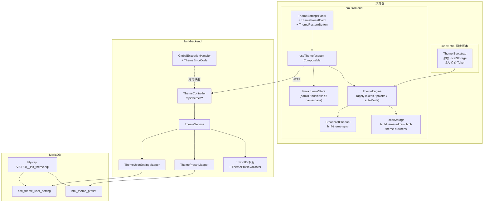
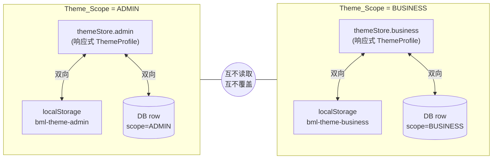
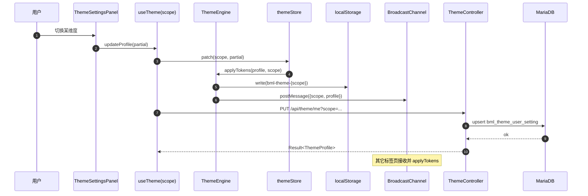
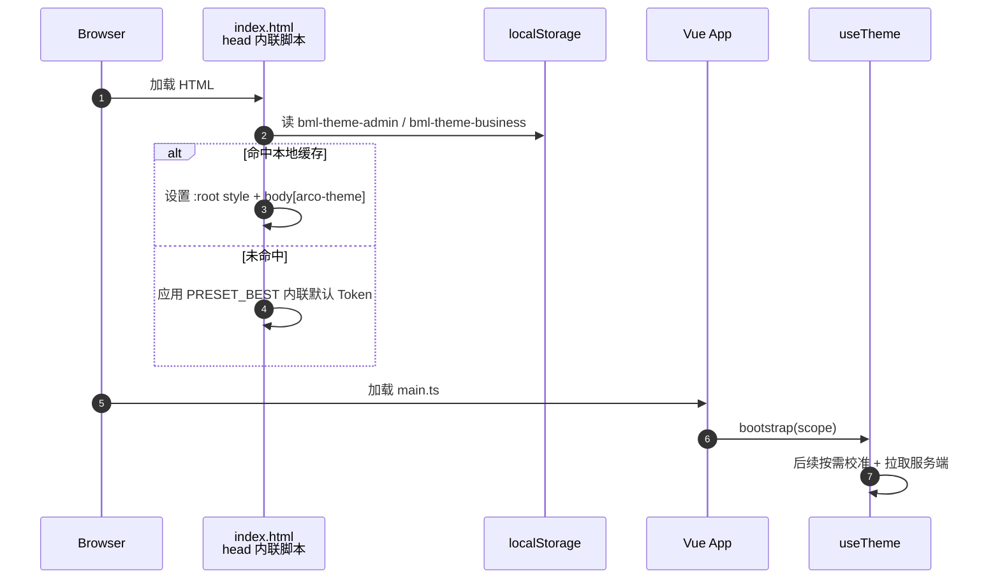

# BML 主题引擎开发者指南

> 本文档面向 BML 平台前后端开发者，系统介绍主题引擎的架构、Token 体系、接入方式与扩展方法。

---

## 目录

1. [架构概览](#1-架构概览)
2. [Token 体系与命名规范](#2-token-体系与命名规范)
3. [`useTheme` 使用指南](#3-usetheme-使用指南)
4. [组件接入](#4-组件接入)
5. [扩展新 Preset 步骤](#5-扩展新-preset-步骤)
6. [扩展新主题维度步骤](#6-扩展新主题维度步骤)
7. [主题维度对照表](#7-主题维度对照表)
8. [常见问题（FAQ）](#8-常见问题faq)

---

## 1. 架构概览

### 1.1 总体架构

BML 主题引擎采用 **"单一引擎，双重作用域"** 设计：底层只有一套 `ThemeEngine` / `useTheme` / 后端表结构，通过 `ThemeScope = ADMIN | BUSINESS` 隔离运行时状态与持久化数据。



### 1.2 作用域隔离模型

Admin 与 Business 两个作用域在 Store、localStorage 和数据库层面完全隔离，互不读取、互不覆盖：



### 1.3 主题数据流

用户在面板中切换维度后的完整数据流：



### 1.4 防 FOUC 引导流程

为消除首屏白闪，在 `<head>` 中内联同步脚本完成 Token 预注入：



---

## 2. Token 体系与命名规范

### 2.1 命名规则

所有主题相关 CSS 自定义属性遵循以下前缀约定：

| 前缀 | 用途 | 示例 |
|------|------|------|
| `--bml-color-*` | 语义色与状态色 | `--bml-color-primary`、`--bml-color-success` |
| `--bml-color-primary-{1..10}` | 主色 10 级色阶 | `--bml-color-primary-6`（主色本身） |
| `--bml-color-text-{1..3}` | 文字色层级 | `--bml-color-text-1`（正文主色） |
| `--bml-color-bg-{1..3}` | 背景色层级 | `--bml-color-bg-1`（页面底色） |
| `--bml-radius-*` | 圆角 | `--bml-radius-sm`、`--bml-radius-md`、`--bml-radius-lg` |
| `--bml-spacing-*` | 间距（紧凑度） | `--bml-spacing-xs` ~ `--bml-spacing-xl` |
| `--bml-font-size-base` | 基础字号 | `14px`（DEFAULT 档位） |
| `--bml-shadow-*` | 阴影 | `--bml-shadow-sm`、`--bml-shadow-md` |
| `--arcoblue-{1..10}` | Arco Design 主色覆盖 | 与 `--bml-color-primary-{1..10}` 同步 |

### 2.2 Token 文件位置

| 文件 | 作用 |
|------|------|
| `src/styles/tokens.scss` | 全局 Token 默认值（等价于 PRESET_BEST 亮色/ADMIN 变体） |
| `src/styles/tokens.preset-best.scss` | PRESET_BEST 四个变体的常量导出（亮/暗 × ADMIN/BUSINESS） |

### 2.3 禁止硬编码

业务组件中**禁止**直接使用主题相关的硬编码颜色、圆角或字号。所有样式必须通过 Token 引用：

```scss
/* ❌ 错误：硬编码颜色 */
.card {
  background: #ffffff;
  border-radius: 8px;
}

/* ✅ 正确：使用 Token */
.card {
  background: var(--bml-color-bg-2);
  border-radius: var(--bml-radius-md);
}
```

开发模式下，`themeEngine` 会在 `console.warn` 中提示未定义的 Token 引用。

---

## 3. `useTheme` 使用指南

### 3.1 基本用法

`useTheme` 是主题系统对外暴露的统一 Composable 入口，位于 `src/composables/useTheme.ts`。

**返回值类型：**

```ts
interface UseThemeReturn {
  profile: Readonly<Ref<ThemeProfile>>;       // 当前作用域只读 Profile
  presets: Readonly<Ref<ThemePreset[]>>;      // 预设列表（含 PRESET_BEST）
  isLoading: Readonly<Ref<boolean>>;          // 加载状态
  error: Readonly<Ref<ThemeError | null>>;    // 最近一次错误
  updateProfile: (partial: Partial<ThemeProfile>) => Promise<void>;
  applyPreset: (presetId: string) => Promise<void>;
  restoreDefault: () => Promise<void>;
  scope: ThemeScope;                          // 当前已解析的作用域
}
```

### 3.2 双作用域示例

#### ADMIN 作用域

